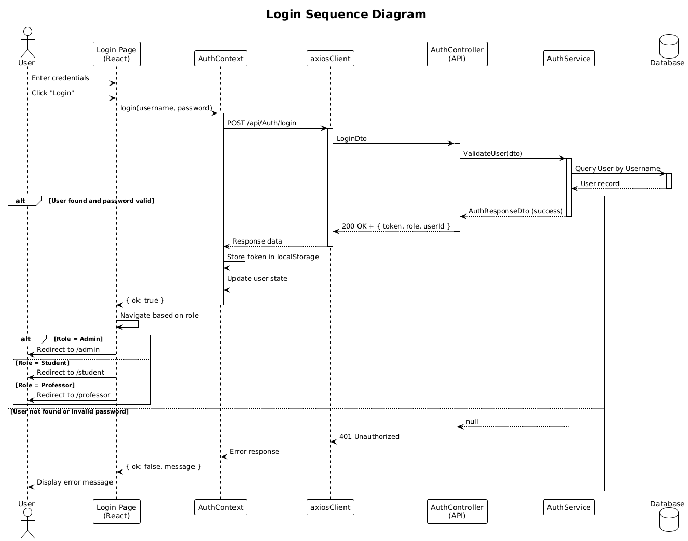
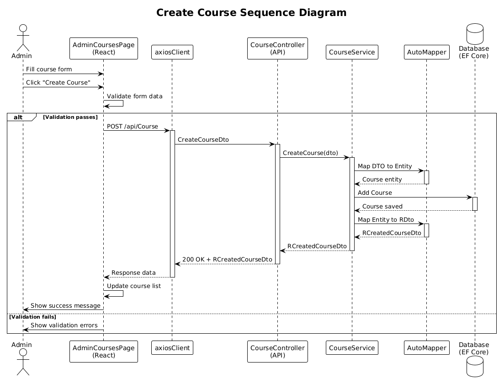
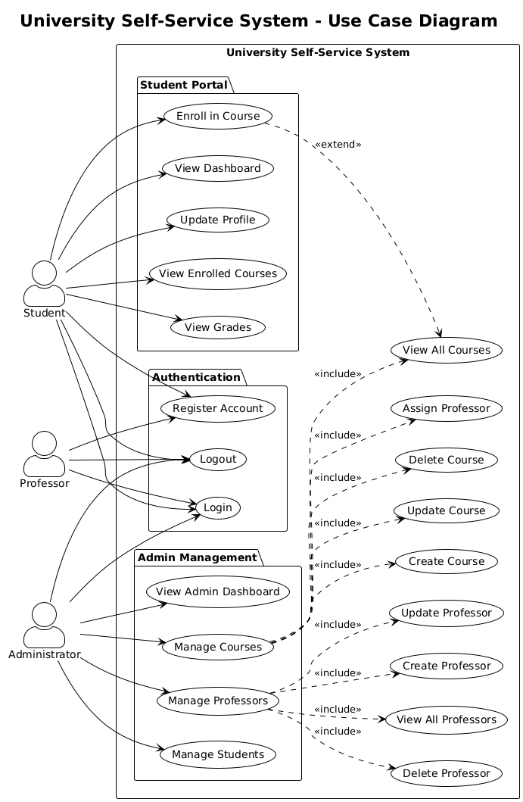
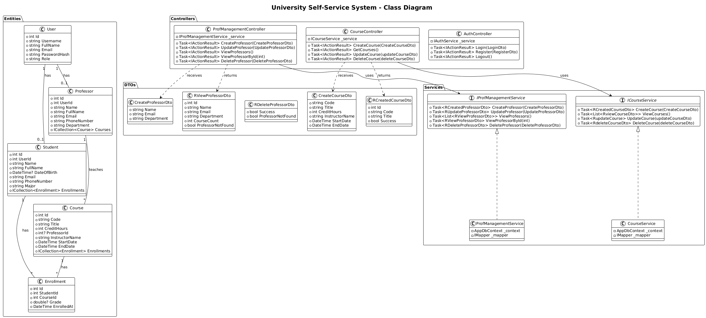

# University Self-Service System

A web-based self-service portal for university students and administrators to manage academic activities.

## Overview

This system provides:
- **Student Portal** - Registration, grade viewing, course enrollment
- **Admin Dashboard** - Manage courses, professors, and students
- **Role-Based Access** - Secure authentication with role-specific features

## Tech Stack

| Layer | Technology |
|-------|------------|
| Frontend | React 18, Vite, React Router |
| Backend | ASP.NET Core 9, C# 13 |
| Database | SQL Server, Entity Framework Core |

## Getting Started

### Prerequisites

- Node.js 18+
- .NET 9 SDK
- SQL Server (or LocalDB)

### Run the Backend

Open a terminal and run:
cd "University Self Service System - Backend" dotnet restore dotnet run

Backend runs at: http://localhost:5000

### Run the Frontend

Open a terminal and run:
cd university-self-service-system-frontend npm install npm run dev

Frontend runs at: http://localhost:4153

## Project Structure

**Backend** - `University Self Service System - Backend/`

| Folder | Purpose |
|--------|---------|
| Controllers/ | API endpoints |
| Services/ | Business logic |
| Entities/ | Database models |
| DTOs/ | Data transfer objects |

**Frontend** - `university-self-service-system-frontend/src/`

| Folder | Purpose |
|--------|---------|
| pages/ | Page components |
| context/ | React context (Auth) |
| components/ | Reusable UI components |

**Documentation** - `docs/`

## Features

| Feature | Status |
|---------|--------|
| User Authentication | ✅ Complete |
| Student Registration | ✅ Complete |
| Grade Viewing | ✅ Complete |
| Course Management (Admin) | ✅ Complete |
| Professor Management (Admin) | 🔲 Backlog |
| Student Management (Admin) | 🔲 Backlog |

## Documentation

| Document | Description |
|----------|-------------|
| [Requirements](docs/REQUIREMENTS.md) | Functional and non-functional requirements |
| [Specifications](docs/SPECIFICATIONS.md) | Technical architecture and API specs |
| [Test Cases](docs/TEST_CASES.md) | 39 comprehensive test cases |

## API Endpoints

| Endpoint | Description |
|----------|-------------|
| POST /api/Auth/login | User authentication |
| GET /api/ProfManagement | List all professors |
| GET /api/Course | List all courses |
| POST /api/Student/register | Student registration |

See [SPECIFICATIONS.md](docs/SPECIFICATIONS.md) for complete API documentation.

## Diagrams

Diagrams are stored in `docs/diagrams`. PNG images are provided for quick viewing; the corresponding PlantUML sources (`.puml`) are included for editing.

Examples:
- Login sequence  
    
  Source: [sequence-diagram-login.puml](docs/diagrams/sequence-diagram-login.puml)

- Create course sequence  
    
  Source: [sequence-diagram-create-course.puml](docs/diagrams/sequence-diagram-create-course.puml)

- Use-case overview  
    
  Source: [use-case-diagram.puml](docs/diagrams/use-case-diagram.puml)

- Class diagram  
    
  Source: [class-diagram.puml](docs/diagrams/class-diagram.puml)

## Author

**Youssef Zein** - Initial development

